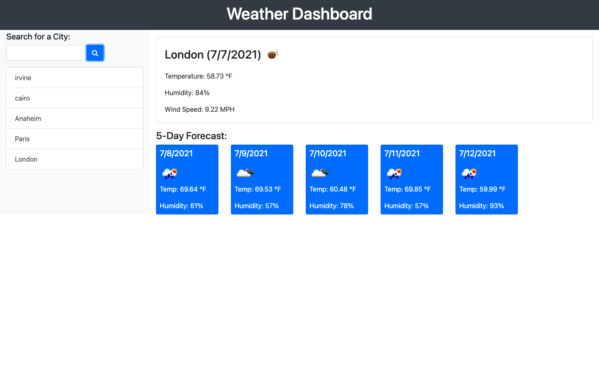

# WeatherDashboard

This application was designed for travelers who want to see the weather outlook for multiple cities so that they can plan their trips accordingly.  The Weather Dashboard allows the user to search for different cities and see both current and future weather conditions.  Each city they search is added to their search history. Should the user choose to leave the app and revisit it later on, local storage allows for the details for their last searched city to be shown automatically.  

## Live Link to Deployed App

https://noreldin-s.github.io/weather-dashboard/

## Technologies Utilized

https://openweathermap.org/api/

## Visualization of App Interface

---

## Contribute

Please submit [bugs and feature requests](https://github.com/Noreldin-S/weather-dashboard/issues)

### Author

[Noreldin Saad](https://github.com/Noreldin-S/)
